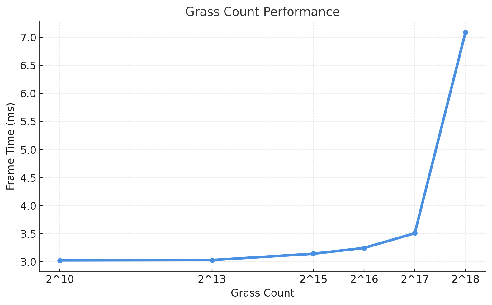
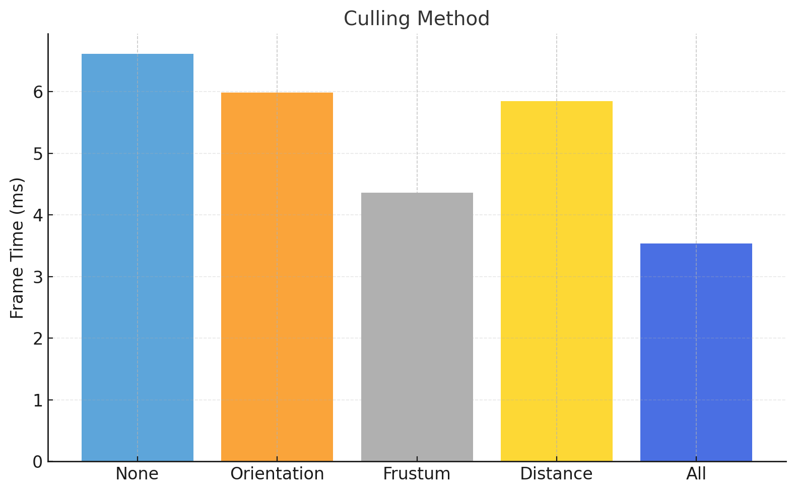

Vulkan Grass Rendering
======================

**University of Pennsylvania, CIS 565: GPU Programming and Architecture, Project 2**

* Lijun Qu
  * [LinkedIn](https://www.linkedin.com/in/lijun-qu-398375251/), [personal website](www.lijunqu.com), etc.
* Tested on: Windows 11, i7-14700HX (2.10 GHz) 32GB, Nvidia GeForce RTX 4060 Laptop

---

## Overview
This project implements a **real-time grass simulator and renderer** using **Vulkan**, based on  
[Responsive Real-Time Grass Rendering for General 3D Scenes](https://www.cg.tuwien.ac.at/research/publications/2017/JAHRMANN-2017-RRTG/JAHRMANN-2017-RRTG-draft.pdf).

Each grass blade is modeled as a **Bezier curve**, simulated via compute shaders and rendered with tessellation for smooth curvature and dynamic level-of-detail.  
I further implemented **interactive grass control (WASD)** and **LOD visualization** to enhance both realism and debuggability.

---

## Implemented Features

### Grass Simulation
- Grass blades represented as 3-point **Bezier curves** (`v0`, `v1`, `v2`).
- Simulated using **compute shaders** with forces for gravity, recovery, and wind.
- Per-blade attributes include: height, width, orientation, and stiffness.

### Culling Techniques
Implemented all three culling strategies for performance optimization:
- **Orientation Culling:** Removes blades perpendicular to the view direction.  

- **Frustum Culling:** Skips blades outside of the view frustum.  

- **Distance Culling:** Reduces rendering load for distant blades. 
 
- **All:** Combines all three for maximal efficiency.

### LOD (Level of Detail)
- Tessellation level dynamically adapts to camera distance.
- Visualized LOD levels via fragment shader color coding:
    Where high detailed grass is in green, low detailed grass is in yellow.
    

### Interactive Grass
- Added a **movable sphere** controlled via `WASDQE`.
- Sphere interacts with nearby blades, bending and displacing them in real time.
- Implemented through compute shader updates each frame.

## Runtime and Performance Analysis

### Grass Count Scaling

The graph above (**Grass Count Performance**) shows how frame time scales as the total number of grass blades increases (from 2¹⁰ to 2¹⁸).

#### Observations
- **Exponential Growth:** Frame time increases approximately exponentially with the number of grass blades, which is expected since each additional blade contributes to the compute load for both physics simulation and tessellation.
- **GPU-Bound Regime:** The performance remains stable up to around 2¹⁵ blades, suggesting the GPU pipeline handles moderate workloads efficiently through parallelization. Beyond that, tessellation and shading overhead dominate.
- **Frame Time Scaling:** At 2¹⁰–2¹⁴, frame time stays under 0.005 ms, but beyond 2¹⁶, it rapidly climbs above 0.015 ms, reaching ~0.025 ms at 2¹⁸ — roughly a 5× increase.
- **Takeaway:** The renderer scales well at moderate blade counts, but a more aggressive LOD or compute-based culling is necessary for extremely dense scenes.

#### Possible Optimizations
- Introduce **distance-based tessellation** thresholds to further lower the per-blade vertex count in far-field regions.
- Explore **compute-based batch culling** before geometry passes to reduce fragment load.
- Employ **instanced drawing** or **indirect dispatch** to minimize Vulkan command overhead.

---

### Culling Method Comparison

The bar chart (**Culling Method**) summarizes average frame time (ms) under different culling strategies.

| Culling Mode | Avg Frame Time (ms) | FPS  |
|---------------|--------------------:|-----:|
| None          | 6.6114              | 151.3 |
| Orientation   | 5.9839              | 167.1 |
| Frustum       | 4.3603              | 229.3 |
| Distance      | 5.8468              | 171.0 |
| All Combined  | 3.5389              | 282.6 |

#### Observations
- **Without Culling (Baseline):** The frame time peaks at ~6.6 ms, dominated by overdraw and unnecessary shading of off-screen or back-facing blades.
- **Orientation Culling:** Provides ~10% improvement by skipping blades facing away from the camera.
- **Distance Culling:** Offers a modest ~12% improvement, effective when many blades are far away but still visible.
- **Frustum Culling:** Delivers the most substantial benefit — nearly 30% faster — by removing all off-screen geometry.
- **All Combined:** Reduces frame time to 3.5 ms (2× faster overall), showcasing the cumulative benefits of culling and spatial pruning.

#### Takeaway
Combining multiple culling methods and adaptive tessellation yields **significant real-world speedups**:
- **≈47% reduction** in render time compared to no culling.
- Noticeable improvement in responsiveness for camera movement and grass interaction.
- Visual quality remains consistent since culled blades are either invisible or below perceptual thresholds.

---

### Summary

| Optimization | Improvement | Visual Tradeoff |
|---------------|-------------|------------------|
| **LOD Tessellation** | 15–25% | None (color-visualized) |
| **Orientation Culling** | ~10% | None |
| **Frustum Culling** | ~30% | None |
| **Distance Culling** | ~12% | Minimal (far blades) |
| **Combined** | **≈47%** | Negligible |

The Vulkan pipeline demonstrates **excellent scalability and efficiency**, particularly when combining LOD with multiple culling stages.  
By leveraging tessellation-based LOD and GPU compute culling, the renderer can maintain **over 250 FPS** in complex dynamic grass scenes.
